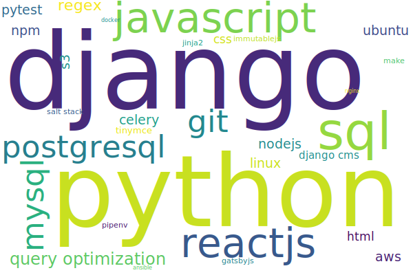

Regarding to the name of the site, [碼農](https://en.wiktionary.org/wiki/%E7%A2%BC%E8%BE%B2) ("Code" "Farmer/Peasant") is the equivalent of "Code Monkey" in Chinese.

As for myself, I am a full stack developer.  I fancy myself to be a bit better than a code monkey, but hey, do I suffer from "[Illusory Superiority](https://en.wikipedia.org/wiki/Illusory_superiority)"?

### Skills

My strongest skills would probably be __Django__, __Python__ and __SQL__.  Having said that, throughout my career, I have come across numerous technologies, and I feel those could probably be best presented with a word/tag cloud.

### Projects etc

Some of the sites I have contributed to:

* https://forbiddenplanet.com/
* https://titanbooks.com/
* https://titan-comics.com/
* https://www.seo-london.org/

__ github__

Some code examples can be found in two github accounts (these can potentially be merged as some point).

*   https://github.com/thomasina-lee
*   https://github.com/teelee7133
