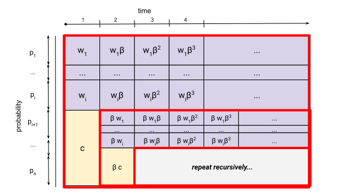

I have been keen to read a bit more about quantitative economics,
ever since I encountered the
[Introductory Quantitative Economics with Python](https://python-intro.quantecon.org/) lectures online.
Some of the topics are interesting for individuals as well.

So today, I pick a topic of interest, the [McCall Search Model](https://python-intro.quantecon.org/mccall_model.html).
I am more interested in the [Cake Eating](https://python-intro.quantecon.org/cake_eating_problem.html) problem to be honest,
but the McCall Search Model is listed as a prerequisit which is also an interesting problem by itself.

I will quickly give problem definition first.  (As this is my journey, the whole problem will be dumbed down a little, and we shall lose some mathematical rigor.)

We assume in each time period a "Loyal Immortal Job Seeker" can get a job offer of value $W_t$, which we assume to be an Independent and Identically distributed discrete random variable (IID) from a finite set $ W_i \in \{w_1 \ldots w_N\}$ where $w_i \ge w_j$ if $i > j$ with probability $P(W=w_i) = p_i$.  If the job seeker accepts the offer he will never quit his job.  The job seeker will receive unemployment benifit of value $c$.  Of course, with inflation, money worth less in the future, and we assume a discount factor of $\beta$ ($\beta < 1$) per time period.

So for example if Mr Job Seeker decide to accept the job offer at time $T$ then the total value will be

$$
    \sum_{t=0}^{T-1}\beta^tc + \sum_{t=T}^{\infty}\beta^tW_T =
         \frac{1 - \beta^T }{1 - \beta}c + \frac{\beta^T}{1 - \beta}W_T
$$

Intuitively, if the Job Seeker is operating in an optimal policy, then

1.  if he reject a salary now, then he will reject the salary of the same value if it is encountered again later.
2.  if he accepts an salary of $w$, it implies that he also accept any salaries greater than $w$.

Also, as previously defined, the wages are drawn from a finite set, with the maxinum value of $w_1$.   So unless $w_1 < c$ (or maximum salary is less than the unemployment benifit), the Job Seeker will accept the this maximum salary if presented.   So the total value (relative to this point in time):

$$
\frac{1}{1 - \beta}w_1
$$

Now lets assume our policy is to only accept salaries $w_i$ or above and reject the rest.  We can calculate the total policy value $v_i$ of each threshold by:

$$
v_i =  \frac{1}{1 - \beta}\sum_{j \le i} {p_jw_j} + (\sum_{j \gt i} {p_j}) (c + \beta v_i)
$$

This is how it can be visualized:

After rearranging, we have
$$
 v_i
=  \frac{
    \frac{1}{1 - \beta}\sum_{j\le i} {p_jw_j} + (\sum_{j\gt i}{p_j}) c
}{(1 - \beta\sum_{j\gt i}{p_j})}
$$

and we can then compare all vallues and find the best total policy value.  (There could be a more effective optimization algorithm out there.  Having said that, even with a brutal force search it is fairly fast.)

In the lecture it is solved somewhat differently, using a technique called [dynamic programming](https://en.wikipedia.org/wiki/Dynamic_programming).
My view is that the algorithms of "dynamic programming" for mathematics feel very different than that for computer science, even though they both come from the same philosphy.